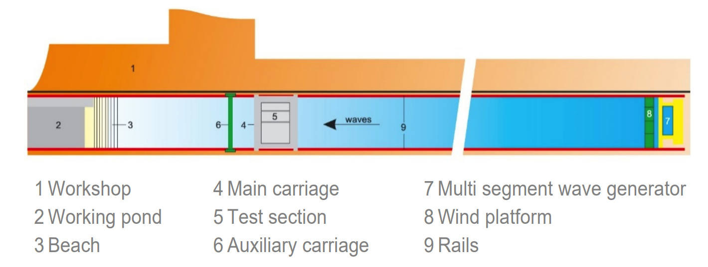
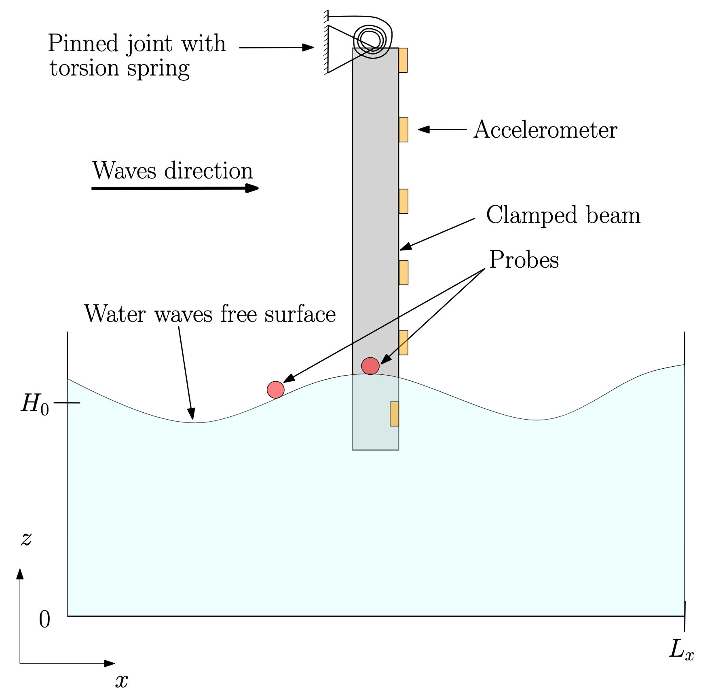
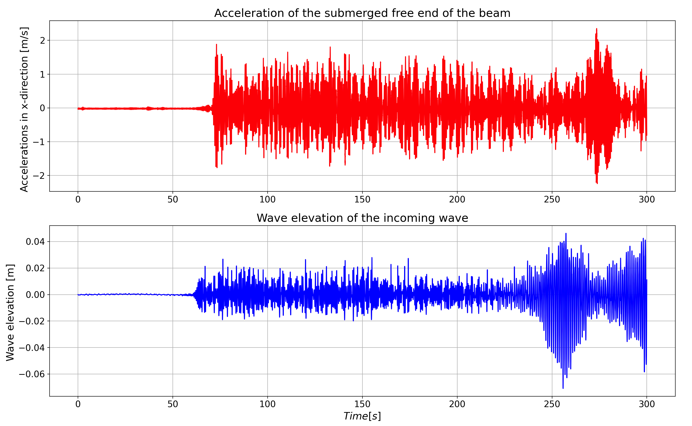

# Experimental Data for the Experimental Modeling of Water-Wave Interactions with a Flexible Beam

This GitHub repository is created to share the experimental data which is presented in the OMAE 2023 conference paper 'Experimental Modeling of Water-Wave Interactions with a Flexible Beam'[1]. The paper has already been accepted for publication; however, it is not publically available yet. The figure and the explanation mentioned here are taken from the paper. The paper presents a series of fluid-structure-interaction (FSI) experiments for studying water-wave interactions with a flexible beam in a wide range of sea conditions thus yielding a variety of FSI test-case data. The experimental campaign is carried out at the Maritime Research Institute Netherland's (MARIN's) concept basin. The concept basin is a 220m-long, 4m-wide and 3.6m-deep rectilinear basin with a carriage that can transverse along the basin's length. One end of the basin is equipped with a waveflap wavemaker to generate water waves while the other end has a wave-breaking beach to avoid wave reflection. The schematic diagram of the concept wave basin is shown in Fig. 1.

Figure 1: The MARIN's concept basin layout is explained [2].

The experimental setup is designed such that it admits the simultaneous measurements of incident waves and the beam's response. Hence, it is suitable for studying FSI problems. The details about the dimensions of the beam and arrangements of the sensors are described in the form of detailed CAD drawings which are given in **CAD_fsi_beam_exp.pdf**. The shared CAD drawings could be used in the future to reproduce the model. To enhance the users' understanding of the experimental setup, a 2D schematic diagram of the setup is shown in Fig. 2. (*Note: The figure is taken from the above-mentioned OMAE paper which is not publically available yet.*)

FIGURE 2: A two-dimensional schematic diagram of the experimental setup is shown [1].

The aim is to use these experimental data to validate FSI solvers commonly employed by the maritime industry in the design of fixed-foundation, offshore wind turbines. The study is divided into three experimental cases which are as follows (click on the case number to read more description):

Case-1 experiments: regular-water-waves interactions with the flexible beam when the carriage is at rest 

- "*Experimental Case 1 concerns interactions of regular waves with the flexible beam when the carriage is at rest; studying this case will facilitate the validation of linear FSI solvers in the non-resonant regime, since the non-linear dynamic response of beam is not excited by the incident-wave frequencies. This experimental case is further divided into two subcases corresponding to different submerged beam lengths. Subcases 1 and 2 respectively have *0.25m* and *0.5m* of the beam submerged*"[1]. 

Case-2 experiments: regular-water-waves interactions with the flexible beam when the carriage is moving at a constant speed

- "*Experimental Case 2 concerns interactions with the flexible beam when the carriage is moving at a constant speed. Moving the carriage changes the frequency of encounter between beam and waves, so that the dynamic response of the beam and its interaction with water waves, particularly at the onset of
resonance, can be studied. By changing the steepness of the regular waves, both linear and nonlinear FSI solvers can be validated. This experimental case is further divided into two subcases corresponding to different submerged beam lengths. Subcases 1 and 2 respectively have *0.25m* and *0.5m* of the beam submerged*"[1].

Case-3 experiments: irregular-water-waves interactions with the flexible beam when the carriage is at rest

- "*Experimental Case 3 concerns steep, irregular-wave interactions with the flexible beam when the carriage is at rest. This is the most complex case and is designed to yield data on structural dynamics due to nonlinear wave-loading processes related to steep and breaking waves. This case will help to validate the high-fidelity FSI solvers*"[1]. 

## FSI Experiments: Interactions of water-waves with a flexible beam

"*All measurements are given in the form of *.h5* format files, each of which has a corresponding *.pan* format file containing details of measurement names, units, frequency, maximum, minimum and standard deviation. The data presented is classified into different folders given as follows:*" 

- Folder **Exp1_carriage_rest_0.25m**; 
- Folder **Exp1_carriage_rest_0.5m**; 
- Folder **Exp2_carriage_moving_0.25m**; 
- Folder **Exp2_carriage_moving_0.5m**; 
- Folder **Exp3_irreg_waves_0.25m**; 
- Folder **Exp3_irreg_waves_0.5m**; and 
- Folder **hammer_test**.

The description of the measurement and corresponding wave parameters is given in each folder. 

## Data organisation

All the main folders have several sub-folders and each sub-folder consists of mainly two types of files, i.e. *.pan* and *.h5m*. The files with extension *.pan* state the general information about experimental tests and sensors in text format. These *.pan* have three rows and the third row is divided into several columns. The second row states the information related to the experimental test, for example, the test number (80372\_XXCB\_XX\_XXX\_XXX\_XX), project name (AEGRE), submerged depth of the beam (Proeven XX), gain, facility name (CB stands for concept basin), and scale (1.000). The first column of the third row shows the abbreviated sensor names which are explained in the table below.

TABLE 1: The names and descriptions of the sensors are listed.
|    Name   |                              Description                             |
|:---------:|:--------------------------------------------------------------------:|
|  C.SPEED  |                            Speed of the carriage.                          |
| WAVE.FORE |   Wave elevation measured by probe located at the front of the beam (26.25 m away from the wavemaker).  |
|  WAVE.SB  |     Wave elevation measured by probe located parallel to the beam (30 m away from the wavemaker).   |
|    AX_i   | Accelerations of the beam in x direction recorded by accelerometer, where i denotes the accelerometer number.|
|    AY_i   | Accelerations of the beam in y direction recorded by accelerometer, where i denotes the accelerometer number. |
|    AZ_i   | Accelerations of the beam in z direction recorded by accelerometer, where i denotes the accelerometer number. |
|Flap 3 Pos | Position of the waveflap wavemaker.                                   |

The number with the accelerations, e.g. AX.1, AY.2, and AZ.3, denotes the location of the accelerometer. The accelerometers are numbered from 1 to 6 where the accelerometer at the submerged free end of the beam is numbered 1 while the one at the fixed end of the beam is numbered 6. The rest of the accelerometers are numbered 2 to 5 from the free end to the fixed end. The files with extension *.h5m* contain the actual time-domain measurements obtained from the sensors. These measurements can be read with the help of post-processing code. MATLAB and Python scripts with comments are shared to read the data. The names of the MATLAB and Python scripts are **read_model_tst.m** and **read_model_tst.py** respectively. The provided MATLAB script is used to plot the wave maker position and it is compared to the signals measured by the wave probe which is located 26.25 m away from the wavemaker. The plot is depicted in Fig. 3.

FIGURE 3: The top plot shows the variation of the position of the waveflap wavemaker as time proceeds. The bottom plot shows the signals measured by the wave probe which is located in front of the beam.

A visual analysis of the plots in Fig 3 shows that the wavemaker starts moving gradually from 0 seconds and takes approximately 4 to 5 seconds to reach its maximum position because the wavemaker motion is ramped when it is about to commence and terminate. This ramped motion helps to keep the free surface smooth. It can be noticed from the bottom plot that the wave probe starts to measure the wave elevation at approximately 26 seconds which is due to the fact that the probe is located 26.25 m away from the wavemaker. Similar to the wavemaker motion, the initial wave elevation signal detected by the probe is small in amplitude which gradually increases to maximum amplitude. In this case, the wave time period is 1 second and the wavelength is 1.56 m. The test is run for 300 seconds which means the probe measures the reflected waves in the last 40 seconds of the test. However, in this case, the effect of the reflected wave on the incident wave is not significant. It is preferable to use the wave data which is not affected by the reflected waves for the code validation purpose.
A plot of the signals, which are obtained from the sensors, is generated by using the Python script. The plot is shown in Fig.4.

FIGURE 4: The top plot shows the accelerations obtained from the accelerometer located at the submerged free-end of the beam when the incident wave, shown in the bottom plot, interacted with the beam.

## References
[1] Rehman, W., Bunnik, T., Bokhove, O. and Kelmanson, M. “Experimental Modeling of Water-Wave Interactions with a Flexible Beam.” *Proc. ASME 2023 42nd Int. Conf. on Ocean, Offshore and Arctic Eng.*: p. 10. 2023. ASME.

[2] MARIN Concept Basin.” file:///Users/mmwr/Downloads/Concept_Basin.pdf. Accessed: 19-11-2022
